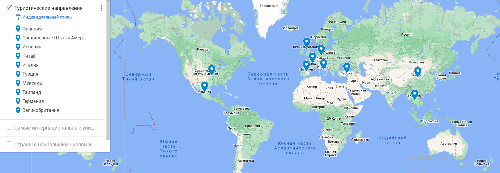

# Google Translate

## Содержание

- ### [Тема, аудитория, функционал](#1-тема-аудитория-функционал)
- ### [Расчет нагрузки](#2-расчет-нагрузки)
- ### [Глобальная балансировка нагрузки](#3-глобальная-балансировка-нагрузки)
- ### [Локальная балансировка нагрузки](#4-локальная-балансировка-нагрузки)
- ### [Логическая схема базы данных](#5-логическая-схема-базы-данных)

## 1 Тема, аудитория, функционал

[Google Translate](https://translate.google.com/) - онлайн-переводчик компании Google, предназначенный для перевода текстов и веб-страниц.

### Основной функционал

- Перевод текста
- Перевод текста с изображения
- Перевод web-страниц
- Сбор обратной связи о качестве перевода

### Аудитория

- 610 млн. пользователей в день [\[1\]](https://en.wikipedia.org/wiki/Google_Translate)
- 711,6 млн. пользователей в месяц [\[2\]](https://pro.similarweb.com/#/digitalsuite/websiteanalysis/overview/website-performance/*/999/1m?webSource=Total&key=translate.google.com)

## 2 Расчет нагрузки

Согласно Digital 2024 Global Overview Report [\[3\]](https://datareportal.com/reports/digital-2024-global-overview-report) еженедельно онлайн-переводчиками пользуются 28,1% пользователей интернета. Ссылаясь на этот же отчет, интернетом пользуется 66,2% населения, то есть 5,35 млрд. человек.  
Имеем, что еженедельно сервисами для перевода пользуются **5,35 \* 0,281 = 1,5 млрд.** человек.

Так как онлайн-переводчики не требуют авторизации, то невозможно достоверно определить DAU и MAU показатели. Помимо этого, можно сказать, что большинство людей, которые пользуются сервисами для перевода, используют их постоянно. То есть, если человек воспользовался переводчиком на этой неделе, то он скорее всего воспользуется им на следующей.

Исходя из рассуждений и расчетов выше, а также факта, что Google Translate имеет наибольшее число скачиваний в магазинах приложений (можно сказать, является самым популярным), будем считать значения аудитории из п. 1 подходящими для анализа нагрузки.

### Перевод текста

Пользователь отправляет текст и получает в ответ перевод. Средняя длина предложения 15-20 слов, средняя длина слова 2-3 слога, то есть **средняя длина** предложения с учетом пробелов равна **(15-20) \* (2-3) \* (2-3) + (14-19) = (74-199) символов** . Из полученного диапазона возьмем медиану - **137 символов**.

Положим, что в среднем пользователь делает два запроса в день длиной два предложения.  
Тогда, исходя из дневного кол-ва пользователей, **RPSтекст = 2 \* 610 млн. / 86400 = 141 тыс.** **Нагрузка** на сеть при этом будет равна **2 \* 2 \* 137 \* 2 Байт \* 610 млн. / 86400 c = 0,06 Гбит/c**. **Суммарный трафик** за день - **648 ГБайт**

### Перевод с картинки

Допустим, в среднем пользователь использует перевод картинки 1 раз в неделю, тогда **RPSизображения = 0,14 \* 610 млн. / 86400 = 1008**.  
Положим средний размер изображения 1,5 МБайт. Исходя из данного размера картинки, **сетевой трафик = 0,14 \* 1,5 МБайт \* 610 млн. / 86400 с = 12 Гбит/c**, а **суммарный суточный трафик = 129600 ГБайт**.

### Перевод web-страницы

Пусть пользователь переводит одину страницу в день. Метрика RPS при этом в два раза меньше, чем у текста, то есть **RPSстраница = 70,5 тыс.**  
Допустим, что текста на странице 30 КБайт. Тогда **сетевой трафик = 1,7 Гбит/c**, **сумарный суточный трафик = 18360 ГБайт**.

### Обратная связь

Положим, что мы находимся в "добром" интернете, и половина пользователей дает обратную связь о переводе, и обратная связь не содержит рекламы и спама.  
Основываясь на значениях RPS предыдущих пунктов получим **RPSобратной связи = (RPSтекст + RPSизображения + RPSстраница) \* 0,5 = 106 тыс.**

Будем считать, что переводом довольны 75% пользователей. Тогда, с учетом процента пользователей, оставляющих обратную связь, **12,5%** пользователей оставляют негативную обратную связь, а **37,5%** - позитивную.  
Пусть настроение обратной связи определяется одним байтом. Например, **0 - негативная**, **1 - позитивная**. При этом, пусть пояснения к негативной обратной связи занимают три предложения. Воспользуемся оценкой длины предложения из [расчета нагрузки перевода текстов](#перевод-текста).  
Тогда  
**сетевой трафик = позитивный трафик + негативный трафик = (610 млн. \* 0,375 \* 1 байт + 610 млн. \* 0,125 \* (1 байт + 137 \* 2 байт)) 86400 с = 0,002 Гбит/c**,  
**суммарный суточный трафик = 21,2 ГБайт**.

### Продуктовые метрики

| Метрика                         | Значение   |
| ------------------------------- | ---------- |
| Месячная аудитория              | 711,6 млн. |
| Дневная аудитория               | 610 млн.   |
| Переводов текстов в день        | 1,22 млрд. |
| Переводов с изображений в день  | 85,4 млн.  |
| Переводов web-страниц в день    | 610 млн.   |
| Получение обратной связи в день | 305 млн.   |

### Технические метрики

#### Запросов в секунду

Пусть пиковая нагрузка больше средней в 2,5 раза.

| Функция                      | RPSсредний | RPSпиковый |
| ---------------------------- | --------------------- | --------------------- |
| Перевод текста               | 141 тыс.              | 352,5 тыс.            |
| Перевод текста с изображения | 1008                  | 2520                  |
| Перевод web-страниц          | 70,5 тыс.             | 176,25 тыс.           |
| Обратная связь               | 106 тыс.              | 265 тыс.              |

#### Сетевой трафик

| Функция                      | Среднесуточный трафик, Гбит/с | Суммарный суточный трафик, ГБайт |
| ---------------------------- | ----------------------------- | -------------------------------- |
| Перевод текста               | 0,06                          | 648                              |
| Перевод текста с изображения | 12                            | 129600                           |
| Перевод web-страниц          | 1,7                           | 18360                            |
| Обратная связь               | 0,002                         | 21,2                             |

## 3 Глобальная балансировка нагрузки

_Подробнее с расположением всех локаций можно ознакомится на Google MyMaps  
https://www.google.com/maps/d/edit?mid=1TMTIwXW3jG85r6fQezCtuEX5COACaQU&usp=sharing_

Для определения местоположения дата-центров и балансировки над ними необходимо определить, где расположены конечные пользователи переводчика.  
В основном онлайн-переводчиками пользуются

- иностранные студенты
- туристы
- иммигранты

То есть, расположение дата-центров будет зависеть от расположения данных групп людей.

Отметим скопления этих групп на карте.

**Самые популярные туристические направления[\[4\]](https://studyinternational.com/news/most-visited-countries-in-the-world/)**

**Самые интернациональные университеты[\[5\]](https://www.timeshighereducation.com/student/best-universities/most-international-universities-world)**

**Страны с наибольшим числом иммигрантов[\[6\]](https://www.un.org/en/development/desa/population/migration/data/estimates2/data/UN_MigrantStockTotal_2019.xlsx)**

Так как для онлайн-переводчика нежелательны большие задержки, необходимо расположить дата-центры как можно ближе к целевой аудитории. Исходя из рисунков выше, а также плотности населения в тех районах, для дата-центров были выбраны следующие города:

- Берлин
- Лондон
- Рим
- Москва
- Шанхай
- Нью-Йорк
- Лос-Анджелес
- Мехико
- Дубай
- Бангкок

Для балансировки нагрузки будет использоваться **BGP-anycast**, так как он лучше работает при балансировке в рамках региона. Для обработки запроса будет выбираться ближайший дата-центр.

## 4 Локальная балансировка нагрузки

### Балансировка

Локальная балансировка будет организована с использованием L7 балансировщика Nginx. IP-адреса машин, на которых запущен балансировщик, должны анонсироваться через BGP для работы BGP-anycast балансировки из предыдущего пункта.

На плечи Nginx, помимо балансировки, ляжет ssl-терминация - это позволит разгрузить сервер основного приложения. Также, в контексте онлайн-переводчика, Nginx даст серьезный прирост по производительности благодаря механизму кэширования HTTP ответов, так как зачастую запросы на переводы могут повторяться от разных пользователей.

Итоговую схему балансировки можно увидеть на схеме.

### Контейнеризация и оркестрация

Сервера с приложением переводчика будут находиться под управлением Kubernetes, который является мощным и широко используемым инструментом оркестрации контейнеров. На каждом узле будет запущен сервис NodePort, который позволит получать внешний трафик через отведенный для этого порт. Сам же трафик до портов будет доставлять Nginx.

## 5 Логическая схема базы данных

Для бизнес-логики перевода текста не нужно хранение какой-либо информации. Однако, необходимо организовать сбор и храненение данных запросов и обратной связи для их последующего использования с целью улучшения результатов перевода. Основное применение этих данных - обучение моделей перевода текстов и моделей распознавания изображений.

### Пользовательские запросы

| Таблица  | Описание                                                                                           |
| :------- | :------------------------------------------------------------------------------------------------- |
| Request  | Пользовательские запросы. Содержит тип запроса: текст, изображение или веб-страница.               |
| Response | Результат перевода.                                                                                |
| Feedback | Обратная связь. Содержит информацию о том, доволен ли пользователь переводом и его комментарий.    |
| Image    | Изображения. Хранит пути как к исходным изображениям, так и к переведенным.                        |
| Text     | Текст. Хранит как исходные, так и переведенные. В эту же таблицу будут добавляться тексты с сайтов |

### Лингвистические данные

| Таблица         | Описание                                               |
| :-------------- | :----------------------------------------------------- |
| WordTranslation | Хранит возможные переводы слов                         |
| WordCount       | Хранит кол-во слов в текстах. Используется для 5-грамм |

#### 5-граммы

Данная структура данных представляет собой 5-мерный массив, элемент fiveGramm[a][b][c][d][e] равен вероятности того, что слова **a, b, c, d и e** идут подряд в предложении. То есть, данная структура данных позволяет подобрать наиболее вероятное слово на основе предыдущего контекста.  
5-граммы являются оптимальным выбором, так как граммы меньшего порядка содержат меньше информации о контексте, а большего - его избыток, что может привести либо к неоправданно сложным расчетам.

### Размеры таблиц

#### Request

|  Поле   |   Тип    | Размер (байт) |
| :-----: | :------: | :-----------: |
| req_id  |   uuid   |      16       |
|  type   | smallint |       2       |
| img_id  |   uuid   |      16       |
| text_id |   uuid   |      16       |

Одна запись = **50 Байт**  
Ежедневный объем - **1,915 млрд** строк, **89 ГБайт** данных.

#### Response

|  Поле   | Тип  | Размер (байт) |
| :-----: | :--: | :-----------: |
| res_id  | uuid |      16       |
| res_id  | uuid |      16       |
| img_id  | uuid |      16       |
| text_id | uuid |      16       |

Одна запись = **64 Байт**  
Ежедневный объем - **1,915 млрд** строк, **114 ГБайт** данных.

#### Feedback

|    Поле     |      Тип      | Размер (байт) |
| :---------: | :-----------: | :-----------: |
| feedback_id |     uuid      |      16       |
|   res_id    |     uuid      |      16       |
| is_positive |    boolean    |       1       |
|   comment   | varchar(1000) |     1000      |

Одна запись <= **1033 Байт**. Среднее значение, исходя из расчетов в [пункте 2](#2-расчет-нагрузки) ~ **581 Байт**.
Ежедневный объем - **305 млн.** записей, **48 ГБайт** данных, **80 ГБайт** - в худшем случае.

#### Image

|  Поле  |      Тип      | Размер (байт) |
| :----: | :-----------: | :-----------: |
| img_id |     uuid      |      16       |
|  path  | varchar(2048) |     2048      |

Одна запись <= **2064 Байт**. Среднее значение ~ **1048 Байт**.  
Ежедневный объем - **170,8 млн.** записей, **166 Гбайт** данных, в худшем случае - **326 Гбайт**.

#### Text

|  Поле   |      Тип      | Размер (байт) |
| :-----: | :-----------: | :-----------: |
| text_id |     uuid      |      16       |
| content | varchar(5000) |     5000      |

Одна запись <= **5016 Байт**. Среднее значение ~ **2516 Байт**.  
Ежедневный объем - **155 млрд.** записей, **354 ТБайт** данных, в худшем случае - **708 ТБайт**.

Для уменьшения объема данных будем записывать каждый второй запрос. Поэтому итоговые значения будут равны  
Ежедневный объем - **77,5 млрд.** записей, **177 ТБайт** данных, в худшем случае - **354 ТБайт**.

#### WordTranslation

|    Поле     |     Тип      | Размер (байт) |
| :---------: | :----------: | :-----------: |
|    word     | varchar(100) |      100      |
| translation | varchar(100) |      100      |

Одна запись <= **200 Байт**. В среднем ~ **100 Байт**.  
Суммарный объем оценить сложно, так как необходимо хранить все возможные переводы всех слов со всех языков на все языки.

#### WordCount

| Поле  |     Тип      | Размер (байт) |
| :---: | :----------: | :-----------: |
| word  | varchar(100) |      100      |
| count |   integer    |       4       |

Одна запись <= **104 Байт**. В среднем ~ **54 Байт**.  
Аналогично, суммарный объем оценить сложно.

#### 5-грамма

Пусть в языке n слов, а вероятность 5-граммы кодируется 4 байтами. Тогда 5-граммы всех возможных слов будут занимать **4 \* n! / (n - 5)! байт**.

### Сводная таблица

|     Таблица     | Описание                                                                                           | Объем                                                                         | RPS на запись | RPS на чтение |
| :-------------: | -------------------------------------------------------------------------------------------------- | ----------------------------------------------------------------------------- | :-----------: | :-----------: |
|     Request     | Пользовательские запросы. Содержит тип запроса: текст, изображение или веб-страница.               | **1,915 млрд** строк, **89 ГБайт** данных                                     |  318,5 тыс.   |       -       |
|    Response     | Результат перевода.                                                                                | **1,915 млрд** строк, **114 ГБайт** данных                                    |  318,5 тыс.   |       -       |
|    Feedback     | Обратная связь. Содержит информацию о том, доволен ли пользователь переводом и его комментарий.    | **305 млн.** записей, **48 ГБайт** данных, **80 ГБайт** - в худшем случае     |  159,25 тыс.  |       -       |
|      Image      | Изображения. Хранит пути как к исходным изображениям, так и к переведенным.                        | **170,8 млн.** записей,**166 Гбайт** данных, в худшем случае - **326 Гбайт**  |     2016      |       -       |
|      Text       | Текст. Хранит как исходные, так и переведенные. В эту же таблицу будут добавляться тексты с сайтов | **77,5 млрд.** записей, **177 ТБайт** данных, в худшем случае - **354 ТБайт** |  105,75 тыс.  |       -       |
| WordTranslation | Хранит возможные переводы слов                                                                     | -                                                                             |       -       |  955,5 тыс.   |
|    WordCount    | Хранит кол-во слов в текстах. Используется для 5-грамм                                             | -                                                                             |       -       |  955,5 тыс.   |
