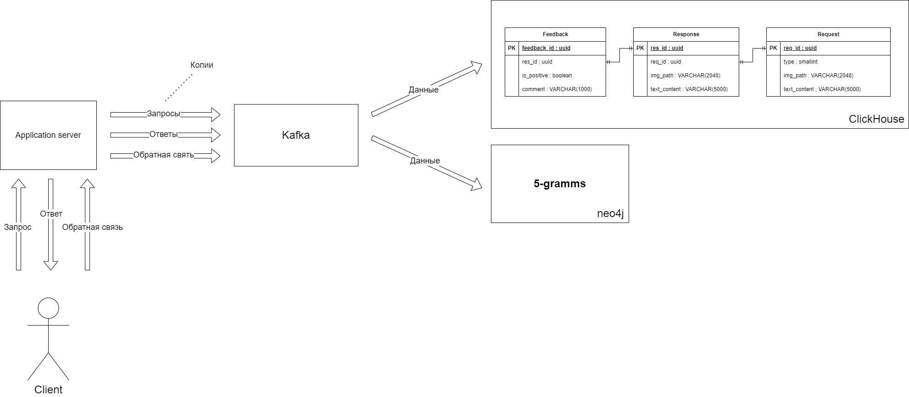
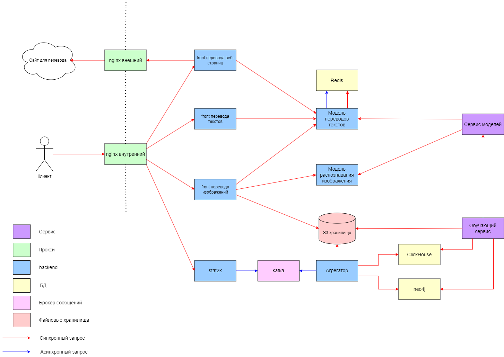

# Google Translate

## Содержание

- ### [Тема, аудитория, функционал](#1-тема-аудитория-функционал)
- ### [Расчет нагрузки](#2-расчет-нагрузки)
- ### [Глобальная балансировка нагрузки](#3-глобальная-балансировка-нагрузки)
- ### [Локальная балансировка нагрузки](#4-локальная-балансировка-нагрузки)
- ### [Логическая схема базы данных](#5-логическая-схема-базы-данных)
- ### [Физическая схема базы данных](#6-физическая-схема-базы-данных)
- ### [Алогоритмы](#7-алгоритмы)
- ### [Технологии](#8-технологии)
- ### [Обеспечение надежности](#9-обеспечение-надежности)
- ### [Схема проекта](#10-схема-проекта)

## 1 Тема, аудитория, функционал

[Google Translate](https://translate.google.com/) - онлайн-переводчик компании Google, предназначенный для перевода текстов и веб-страниц.

### Основной функционал

- Перевод текста
- Перевод текста с изображения
- Перевод web-страниц
- Сбор обратной связи о качестве перевода

### Аудитория

- 610 млн. пользователей в день [\[1\]](https://en.wikipedia.org/wiki/Google_Translate)
- 711,6 млн. пользователей в месяц [\[2\]](https://pro.similarweb.com/#/digitalsuite/websiteanalysis/overview/website-performance/*/999/1m?webSource=Total&key=translate.google.com)

## 2 Расчет нагрузки

Согласно Digital 2024 Global Overview Report [\[3\]](https://datareportal.com/reports/digital-2024-global-overview-report) еженедельно онлайн-переводчиками пользуются 28,1% пользователей интернета. Ссылаясь на этот же отчет, интернетом пользуется 66,2% населения, то есть 5,35 млрд. человек.  
Имеем, что еженедельно сервисами для перевода пользуются **5,35 \* 0,281 = 1,5 млрд.** человек.

Так как онлайн-переводчики не требуют авторизации, то невозможно достоверно определить DAU и MAU показатели. Помимо этого, можно сказать, что большинство людей, которые пользуются сервисами для перевода, используют их постоянно. То есть, если человек воспользовался переводчиком на этой неделе, то он скорее всего воспользуется им на следующей.

Исходя из рассуждений и расчетов выше, а также факта, что Google Translate имеет наибольшее число скачиваний в магазинах приложений (можно сказать, является самым популярным), будем считать значения аудитории из п. 1 подходящими для анализа нагрузки.

### Перевод текста

Пользователь отправляет текст и получает в ответ перевод. Средняя длина предложения 15-20 слов, средняя длина слова 2-3 слога, то есть **средняя длина** предложения с учетом пробелов равна **(15-20) \* (2-3) \* (2-3) + (14-19) = (74-199) символов** . Из полученного диапазона возьмем медиану - **137 символов**.

Положим, что в среднем пользователь делает два запроса в день длиной два предложения.  
Тогда, исходя из дневного кол-ва пользователей, **RPSтекст = 2 \* 610 млн. / 86400 = 141 тыс.** **Нагрузка** на сеть при этом будет равна **2 \* 2 \* 137 \* 2 Байт \* 610 млн. / 86400 c = 0,06 Гбит/c**. **Суммарный трафик** за день - **648 ГБайт**

### Перевод с картинки

Допустим, в среднем пользователь использует перевод картинки 1 раз в неделю, тогда **RPSизображения = 0,14 \* 610 млн. / 86400 = 1008**.  
Положим средний размер изображения 1,5 МБайт. Исходя из данного размера картинки, **сетевой трафик = 0,14 \* 1,5 МБайт \* 610 млн. / 86400 с = 12 Гбит/c**, а **суммарный суточный трафик = 129600 ГБайт**.

### Перевод web-страницы

Пусть пользователь переводит одину страницу в день. Метрика RPS при этом в два раза меньше, чем у текста, то есть **RPSстраница = 70,5 тыс.**  
Допустим, что текста на странице 30 КБайт. Тогда **сетевой трафик = 1,7 Гбит/c**, **сумарный суточный трафик = 18360 ГБайт**.

### Обратная связь

Положим, что мы находимся в "добром" интернете, и половина пользователей дает обратную связь о переводе, и обратная связь не содержит рекламы и спама.  
Основываясь на значениях RPS предыдущих пунктов получим **RPSобратной связи = (RPSтекст + RPSизображения + RPSстраница) \* 0,5 = 106 тыс.**

Будем считать, что переводом довольны 75% пользователей. Тогда, с учетом процента пользователей, оставляющих обратную связь, **12,5%** пользователей оставляют негативную обратную связь, а **37,5%** - позитивную.  
Пусть настроение обратной связи определяется одним байтом. Например, **0 - негативная**, **1 - позитивная**. При этом, пусть пояснения к негативной обратной связи занимают три предложения. Воспользуемся оценкой длины предложения из [расчета нагрузки перевода текстов](#перевод-текста).  
Тогда  
**сетевой трафик = позитивный трафик + негативный трафик = (610 млн. \* 0,375 \* 1 байт + 610 млн. \* 0,125 \* (1 байт + 137 \* 2 байт)) 86400 с = 0,002 Гбит/c**,  
**суммарный суточный трафик = 21,2 ГБайт**.

### Продуктовые метрики

| Метрика                         | Значение   |
| ------------------------------- | ---------- |
| Месячная аудитория              | 711,6 млн. |
| Дневная аудитория               | 610 млн.   |
| Переводов текстов в день        | 1,22 млрд. |
| Переводов с изображений в день  | 85,4 млн.  |
| Переводов web-страниц в день    | 610 млн.   |
| Получение обратной связи в день | 305 млн.   |

### Технические метрики

#### Запросов в секунду

Пусть пиковая нагрузка больше средней в 2,5 раза.

| Функция                      | RPSсредний | RPSпиковый |
| ---------------------------- | --------------------- | --------------------- |
| Перевод текста               | 141 тыс.              | 352,5 тыс.            |
| Перевод текста с изображения | 1008                  | 2520                  |
| Перевод web-страниц          | 70,5 тыс.             | 176,25 тыс.           |
| Обратная связь               | 106 тыс.              | 265 тыс.              |

#### Сетевой трафик

| Функция                      | Среднесуточный трафик, Гбит/с | Суммарный суточный трафик, ГБайт |
| ---------------------------- | ----------------------------- | -------------------------------- |
| Перевод текста               | 0,06                          | 648                              |
| Перевод текста с изображения | 12                            | 129600                           |
| Перевод web-страниц          | 1,7                           | 18360                            |
| Обратная связь               | 0,002                         | 21,2                             |

## 3 Глобальная балансировка нагрузки

_Подробнее с расположением всех локаций можно ознакомится на Google MyMaps  
https://www.google.com/maps/d/edit?mid=1TMTIwXW3jG85r6fQezCtuEX5COACaQU&usp=sharing_

Для определения местоположения дата-центров и балансировки над ними необходимо определить, где расположены конечные пользователи переводчика.  
В основном онлайн-переводчиками пользуются

- иностранные студенты
- туристы
- иммигранты

То есть, расположение дата-центров будет зависеть от расположения данных групп людей.

Отметим скопления этих групп на карте.

**Самые популярные туристические направления[\[4\]](https://studyinternational.com/news/most-visited-countries-in-the-world/)**

**Самые интернациональные университеты[\[5\]](https://www.timeshighereducation.com/student/best-universities/most-international-universities-world)**

**Страны с наибольшим числом иммигрантов[\[6\]](https://www.un.org/en/development/desa/population/migration/data/estimates2/data/UN_MigrantStockTotal_2019.xlsx)**

Так как для онлайн-переводчика нежелательны большие задержки, необходимо расположить дата-центры как можно ближе к целевой аудитории. Исходя из рисунков выше, а также плотности населения в тех районах, для дата-центров были выбраны следующие города:

- Берлин
- Лондон
- Рим
- Москва
- Шанхай
- Нью-Йорк
- Лос-Анджелес
- Мехико
- Дубай
- Бангкок

Для балансировки нагрузки будет использоваться **BGP-anycast**, так как он лучше работает при балансировке в рамках региона. Для обработки запроса будет выбираться ближайший дата-центр.

## 4 Локальная балансировка нагрузки

### Балансировка

Локальная балансировка будет организована с использованием L7 балансировщика Nginx. IP-адреса машин, на которых запущен балансировщик, должны анонсироваться через BGP для работы BGP-anycast балансировки из предыдущего пункта.

На плечи Nginx, помимо балансировки, ляжет ssl-терминация - это позволит разгрузить сервер основного приложения. Также, в контексте онлайн-переводчика, Nginx даст серьезный прирост по производительности благодаря механизму кэширования HTTP ответов, так как зачастую запросы на переводы могут повторяться от разных пользователей.

Итоговую схему балансировки можно увидеть на схеме.

### Контейнеризация и оркестрация

Сервера с приложением переводчика будут находиться под управлением Kubernetes, который является мощным и широко используемым инструментом оркестрации контейнеров. На каждом узле будет запущен сервис NodePort, который позволит получать внешний трафик через отведенный для этого порт. Сам же трафик до портов будет доставлять Nginx.

## 5 Логическая схема базы данных

Для бизнес-логики перевода текста не нужно хранение какой-либо информации. Однако, необходимо организовать сбор и храненение данных запросов и обратной связи для их последующего использования с целью улучшения результатов перевода. Основное применение этих данных - обучение моделей перевода текстов и моделей распознавания изображений.

### Пользовательские запросы

| Таблица  | Описание                                                                                           |
| :------- | :------------------------------------------------------------------------------------------------- |
| Request  | Пользовательские запросы. Содержит тип запроса: текст, изображение или веб-страница.               |
| Response | Результат перевода.                                                                                |
| Feedback | Обратная связь. Содержит информацию о том, доволен ли пользователь переводом и его комментарий.    |
| Image    | Изображения. Хранит пути как к исходным изображениям, так и к переведенным.                        |
| Text     | Текст. Хранит как исходные, так и переведенные. В эту же таблицу будут добавляться тексты с сайтов |

#### 5-граммы

Данная структура данных представляет собой 5-мерный массив, элемент fiveGramm[a][b][c][d][e] равен вероятности того, что слова **a, b, c, d и e** идут подряд в предложении. То есть, данная структура данных позволяет подобрать наиболее вероятное слово на основе предыдущего контекста.  
5-граммы являются оптимальным выбором, так как граммы меньшего порядка содержат меньше информации о контексте, а большего - его избыток, что может привести либо к неоправданно сложным расчетам.

### Размеры таблиц и данных

#### Request

|  Поле   |   Тип    | Размер (байт) |
| :-----: | :------: | :-----------: |
| req_id  |   uuid   |      16       |
|  type   | smallint |       2       |
| img_id  |   uuid   |      16       |
| text_id |   uuid   |      16       |

Одна запись = **50 Байт**  
Ежедневный объем - **1,915 млрд** строк, **89 ГБайт** данных.

#### Response

|  Поле   | Тип  | Размер (байт) |
| :-----: | :--: | :-----------: |
| res_id  | uuid |      16       |
| res_id  | uuid |      16       |
| img_id  | uuid |      16       |
| text_id | uuid |      16       |

Одна запись = **64 Байт**  
Ежедневный объем - **1,915 млрд** строк, **114 ГБайт** данных.

#### Feedback

|    Поле     |      Тип      | Размер (байт) |
| :---------: | :-----------: | :-----------: |
| feedback_id |     uuid      |      16       |
|   res_id    |     uuid      |      16       |
| is_positive |    boolean    |       1       |
|   comment   | varchar(1000) |     1000      |

Одна запись <= **1033 Байт**. Среднее значение, исходя из расчетов в [пункте 2](#2-расчет-нагрузки) ~ **581 Байт**.
Ежедневный объем - **305 млн.** записей, **48 ГБайт** данных, **80 ГБайт** - в худшем случае.

#### Image

|  Поле  |      Тип      | Размер (байт) |
| :----: | :-----------: | :-----------: |
| img_id |     uuid      |      16       |
|  path  | varchar(2048) |     2048      |

Одна запись <= **2064 Байт**. Среднее значение ~ **1048 Байт**.  
Ежедневный объем - **170,8 млн.** записей, **166 Гбайт** данных, в худшем случае - **326 Гбайт**.

#### Text

|  Поле   |      Тип      | Размер (байт) |
| :-----: | :-----------: | :-----------: |
| text_id |     uuid      |      16       |
| content | varchar(5000) |     5000      |

Одна запись <= **5016 Байт**. Среднее значение ~ **2516 Байт**.  
Ежедневный объем - **155 млрд.** записей, **354 ТБайт** данных, в худшем случае - **708 ТБайт**.

Для уменьшения объема данных будем записывать каждый второй запрос. Поэтому итоговые значения будут равны  
Ежедневный объем - **77,5 млрд.** записей, **177 ТБайт** данных, в худшем случае - **354 ТБайт**.

#### 5-грамма

Пусть в языке n слов, а вероятность 5-граммы кодируется 4 байтами. Тогда 5-граммы всех возможных слов будут занимать **4 \* n! / (n - 5)! байт**.

Google-переводчик поддерживает 133 языка на 2022 год[\[7\]](https://blog.google/products/translate/24-new-languages/). Литературные словори содержат 200-400 тысяч слов. Будем считать, что 5-граммы определены для 10% возможных последовательностей слов, то есть, лишь 10% из всех возможных комбинаций встречались в пользовательских запросах, а реально кол-во слов языка, которые используют пользователи равно 300 тыс. Тогда, для 10 самых популярых языков 5-граммы будут занимать **10 \* 0,1 \* 4 \* (300 тыс.)! / (300 тыс. - 5)! = 9,71968 \* 10^27 байт = 8,4305 \* 10^9 эксабайт**

### Сводная таблица

| Таблица  | Описание                                                                                           | Объем                                                                         | RPS на запись | RPS на чтение |
| :------: | -------------------------------------------------------------------------------------------------- | ----------------------------------------------------------------------------- | :-----------: | :-----------: |
| Request  | Пользовательские запросы. Содержит тип запроса: текст, изображение или веб-страница.               | **1,915 млрд** строк, **89 ГБайт** данных                                     |  318,5 тыс.   |       -       |
| Response | Результат перевода.                                                                                | **1,915 млрд** строк, **114 ГБайт** данных                                    |  318,5 тыс.   |       -       |
| Feedback | Обратная связь. Содержит информацию о том, доволен ли пользователь переводом и его комментарий.    | **305 млн.** записей, **48 ГБайт** данных, **80 ГБайт** - в худшем случае     |  159,25 тыс.  |       -       |
|  Image   | Изображения. Хранит пути как к исходным изображениям, так и к переведенным.                        | **170,8 млн.** записей,**166 Гбайт** данных, в худшем случае - **326 Гбайт**  |     2016      |       -       |
|   Text   | Текст. Хранит как исходные, так и переведенные. В эту же таблицу будут добавляться тексты с сайтов | **77,5 млрд.** записей, **177 ТБайт** данных, в худшем случае - **354 ТБайт** |  105,75 тыс.  |       -       |
| 5-граммы | Вероятности того, что 5 слов идут подряд в предложении                                             | **8,4305 \* 10^9 эксабайт**                                                   |       -       |       -       |

## 6 Физическая схема базы данных

### Денормализация

Так как на исходной схеме таблицы имеют связи 1 к 1, то для избежания ненужных join\`ов объединим все имеющиеся сущности в две "широкие" таблицы - `request` и `response`, а также оставим таблицу `feedback`.  
Такое разделение было выбрано, потому что при нем нет update\`ов таблиц. Например, если бы мы объединили таблицы `request` и `respose`, исходя из связи 1 к 1, то нам бы сначала пришлось добавлять в таблицу запись с данными запроса, а потом, после завершения обработки этого запроса, искать в таблице эту же запись и обновлять данные ответа. При разбиении же на две отдельные таблицы мы можем выполнять только операции добавления.

### Хранение изображений

Как было подсчитано в [пункте 2](#2-расчет-нагрузки), для изображений **суммарный суточный трафик = 129600 ГБайт**. Чтобы уменьшить занимаемое изображениями место на диске, будем хранить изображения в течение недели, по истечению которой они будут удаляться. Помимо этого, будем сохранять не все изображения, а лишь половину.

Итого, общий объем памяти для изображений будет равен **7 \* 0,5 \* 129600 ГБайт = 453600 ГБайт ≈ 443 ТБайт**.

Решение сэкономить память на изображениях была принято для того, чтобы хранить потенциально больше информации, необходимой для улучшения точности переводов, а именно исходные и переведенные тексты.

### 5-граммы

#### Представление в виде графа

Будем хранить 5-граммы в виде взвешенного ориентированного графа, где вес ребра, ведущее из вершины i в вершину j, равен вероятности того, что слова i и j идут подряд в предложении. Организовав таким образом хранение, мы сможем быстрее подбирать подходящие переводы, так как следующий перевод слова будет искаться среди ограниченного числа слов, связанных с предыдущим. Кроме того, хранение 5-грамм в виде графов позволит не хранить вероятности для цепочек слов, которые ни разу не встретились. Однако, нам придется потратить в четыре раза больше памяти на хранение вероятностей, так как теперь вместо вероятности сразу целой цепочки слов, будут храниться шансы отдельных биграмм в 5-граммах.

#### Шардирование

Так как число ребер в графе 5-грамм много больше, чем число вершин, то шардирование графа будет основываться на остовных деревьях[\[8\]](https://ru.wikipedia.org/wiki/%D0%9E%D1%81%D1%82%D0%BE%D0%B2%D0%BD%D0%BE%D0%B5_%D0%B4%D0%B5%D1%80%D0%B5%D0%B2%D0%BE), а именно **один шард == одно остовное дерево**.  
Важная деталь такого шардирования - это веса данных деревьев. Чем больше вес, тем более частые цепочки слов находятся в этом дереве. Исходя из этого, имеет смысл искать не просто остовные деревья, а остовные деревья максимального веса, чтобы выделать шарды с наиболее часто встречающимися последовательностями слов.

### Системы хранения

Для хранения запросов и ответов, а так же обратной связи на них, будем использовать колоночную СУБД `ClickHouse`, поскольку она заточена под OLAP нагрузку. Однако ClickHouse имеет особенность - необходимо вносить данные большими порциями. Поэтому для буферизации, а также для надежной доставки данных будем использовать стиминговую СУБД `Kafka`. Поставщиком данных в этом случае будут сервера-приложения, обрабатывающие запросы от клиентов.

Для хранения 5-грамм будем использовать графо-ориентированную СУБД `neo4j`. Она является самой распространенной графовой СУБД[\[9\]](https://db-engines.com/en/ranking/graph+dbms) и программно заточена на обработку множества значений, представленных в виде графов.

Итоговая схема хранения данных с сущностями и СУБД представлена ниже.

## 7 Алгоритмы

Перевод текстов и изображений будет осуществляться путем нейронных сетей. Рассмотрим в общем алгоритмы работы двух моделей, а так же их взаимодействие.

### Перевод текстов

Так как хранения контекста всего текста требует больших объемов памяти и не дает сильного преимущества, будем хранить контекст на уровне отдельных предложений. С учетом этого, алгоритм перевода выглядит следующем образом:

1. Предложение разбивается на отдельные слова
2. Определяется семантическое значение слова
3. Анализируется контекст как предыдущих слов, так и следующих за исходным
4. На основе контекста и семантики подбирается подходящий перевод (здесь используются 5-граммы)
5. Полученное предложение проверяется на соответствие грамматике языка (на этом этапе к слову возвращается его форма)

### Распознавание текста на изображении

1. Найти текст на заданном языке на изображении
2. Получить его "текстовое" представление
3. Встроить перевод текста на исходное изображение

### Взаимодействие

Для уменьшения времени перевода текста с изображения можно выполнять части алгоритмов параллельно, а именно как только модель распознавания текста смогла считать слова с картинки, следует передать их сразу модели перевода, а после этого начать расчет того, как нужно расположить потенциальный перевод на фотографии. Благодаря этому, модель распознавания изображений не будет простаивать в ожидании перевода текста.

## 8 Технологии

| Технология   | Область применения                    | Мотивация                                                                                                                                        |
| :----------- | ------------------------------------- | ------------------------------------------------------------------------------------------------------------------------------------------------ |
| Go           | Backend/Сервер-приложение             | Простая асинхронная модель, высокая производительность и надёжность                                                                              |
| PyTorch      | Backend/Нейронная сеть                | Бóльшая производительность в сравнении с конкурентами, оринетированность на глубокое машинное обучение                                           |
| React Native | Frontend                              | Возможность создавать кросс-платформенные приложения, что важно для переводчика, так как большинство людей пользуются переводчиками на телефонах |
| Nginx        | Балансировщик                         | Скорость, масштабируемость, параллельная обработка множества соединений                                                                          |
| Kubernetes   | Оркестрация микросервисов             | Масштабируемость, эффективное использование ресурсов                                                                                             |
| ClickHouse   | Аналитическа СУБД                     | Эффективная обработка аналитических запросов на больших данных                                                                                   |
| Neo4j        | Аналитическа СУБД для 5-грамм         | Нативная поддержка графов на уровне архитектуры СУБД                                                                                             |
| Kafka        | Доставка данных до аналитических СУБД | Масштабируемость, надежность                                                                                                                     |
| Redis        | Кэширование переводов                 | Скорость, гибкость относительно аналогов                                                                                                         |

## 9 Обеспечение надежности

| Область                        | Обеспечение надежности                                                      |
| :----------------------------- | --------------------------------------------------------------------------- |
| L7 балансировщик / Точка входа | Запуск нескольких экземпляров                                               |
| Сервис переводов               | Повторные запросы до узла, резервирование состояния модели                  |
| Kubernetes                     | Динамическое масштабирование исходя из нагрузки, регулярные health check\`и |

Для остальных компонентов системы, таких как ClickHouse и neo4j надежность не важна, так как они хранят статистические данные, от потери которых работа переводчика не нарушится.

## 10 Схема проекта

- Внутренний nginx является обратным прокси-сервером, обеспечивающим доступ к сервису и выполняющим ssl-терминацию и локальную балансировку нагрузки, которая работает по алгоритму round-robin. Трафик же к экземплярам nginx доставляет система глобальной балансировки, организованной на основе BGP-anycast. Внешний nginx работает по принципу прямого прокси-сервера и служит для безопасного доступа к внешним ресурсам.

- Для каждого типа перевода - перевод текста, перевод изображения, перевод веб-страницы - существует свой frontend сервер, который агрегирует результаты ответов от различных моделей. Помимо этого, данные frontend'ы балансируют нагрузку до моделей по алгоритму round-robin.

- Для сбора результатов перевода и обратной связи имеется отдельный микросервис fb2k, который складывает исходный и переведенный тексты, ссылки на изображения и отправляет эти данные в kafka.

- Микросервис "Агрегатор" проверяет целостность данных, полученных из kafka: проверяет наличие соответствующих изображений в облаке и удаляет возможные дубликаты сообщений из kafka. После проверки он сохраняет результаты в СУБД ClickHouse и neo4j для дальнейшей аналитики.

- Для работы с моделями существует два служебных сервиса: обучающий сервис и сервис моделей. Первый обучает новые модели на основе собранных данных. Второй же служит для хранения различных версий моделей и их выкатки в работу.
